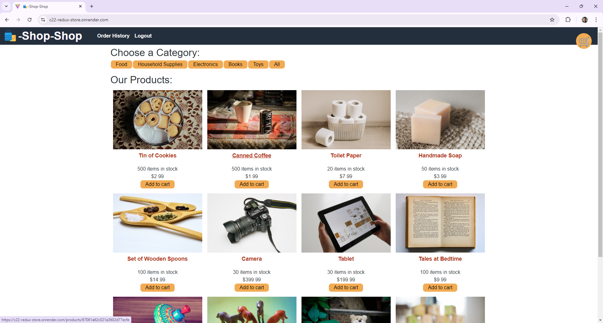
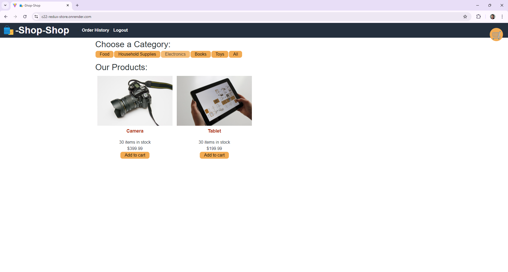
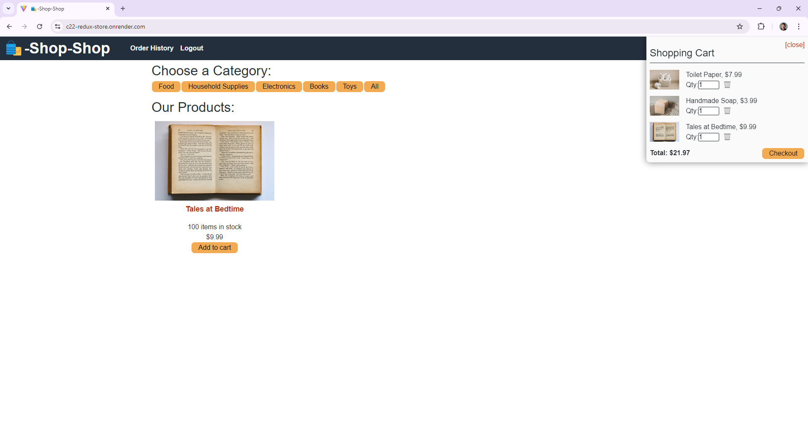
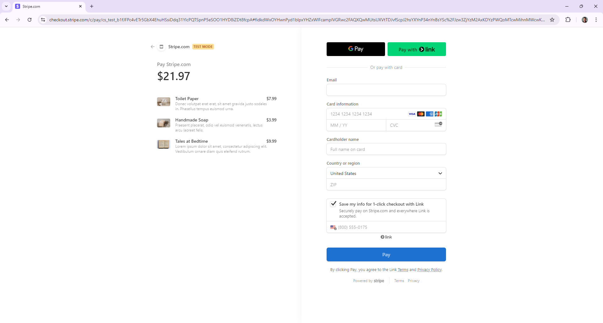

# Redux E-Commerce Platform

This project is a refactored e-commerce platform that utilizes Redux for state management. It provides a seamless shopping experience with features like product browsing, cart management, and checkout process.

## Attribution

Original code provided by UT Austin Coding Bootcamp, Activity 26.
Refactored by [Mountainmancodes](https://github.com/Mountainmancodes)

## Table of Contents

- [Features](#features)
- [Live Demo](#live-demo)
- [Examples](#examples)
- [Technology Stack](#technology-stack)
- [Redux Implementation](#redux-implementation)
- [User Journey](#user-journey)
- [Installation and Setup](#installation-and-setup)
- [License](#license)

## Features

- **Product Catalog**: Browse through a variety of products
- **Category Filtering**: Filter products by categories
- **Shopping Cart**: Add, remove, and update quantities of items
- **Checkout Process**: Secure checkout with Stripe integration
- **User Authentication**: Sign up, log in, and view order history

## Live Demo

Check out the live demo: [Redux E-Commerce Platform](https://c22-redux-store.onrender.com)

## Examples

### Initial Store View

### Product Listing and 

### Shopping Cart

### Checkout Process

## Technology Stack

- React.js
- Redux for state management
- Node.js and Express.js server
- MongoDB with Mongoose ODM
- GraphQL with Apollo Server
- JWT for authentication

## Redux Implementation

The project has been refactored to use Redux for global state management, replacing the previous Context API implementation. This change provides more predictable state updates and better performance for complex state interactions.

Key areas of Redux implementation:

- Product inventory management
- Shopping cart state
- User authentication state
- Category selection and filtering

## User Journey

1. **Browse Products**: Users start on the main page, viewing all available products.
2. **Filter by Category**: Users can select categories to filter the product view.
3. **Add to Cart**: Items can be added to the shopping cart from the product listings.
4. **Manage Cart**: Users can view and modify their cart contents.
5. **Checkout**: Proceed to checkout for a secure payment process.

## Installation and Setup

1. Clone the repository
2. Install dependencies with `npm install`
3. Set up your MongoDB database
4. Configure environment variables
5. Run the development server with `npm run develop`

## License

This project is licensed under the MIT License.